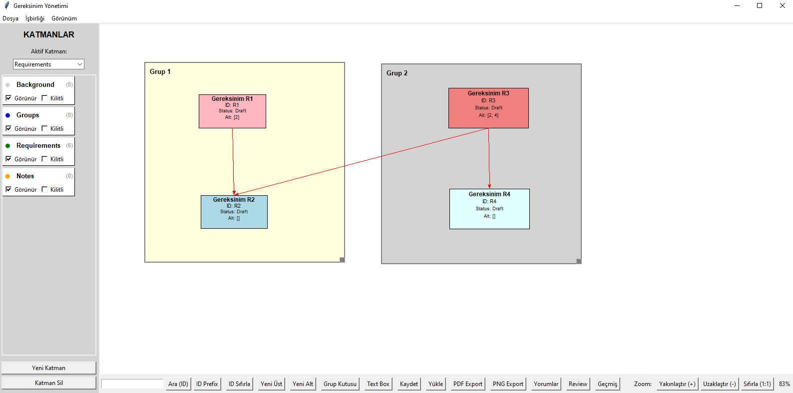

# 🎯 Requirements Management Tool

> **A comprehensive Python application for professional requirements management and team collaboration**



---

## 🌟 Features

### 🎨 **Core Functionality**
- **📦 Requirement Boxes**: Create upper and lower level requirements
- **🗂️ Group Containers**: Organize requirements into categories
- **📝 Text Boxes**: Add free-form notes and annotations
- **🖱️ Drag & Drop**: All objects are draggable and resizable
- **🔗 Connection System**: Parent-child requirement relationships

### 🎛️ **Layer Management System**
- **📚 Multiple Layers**: Background, Groups, Requirements, Notes
- **👁️ Visibility Control**: Show/hide layers independently
- **🔒 Layer Locking**: Prevent accidental edits
- **🎨 Color Coding**: Unique colors for each layer
- **➕ Custom Layers**: Add layers as needed

### 💬 **Collaboration Features**
- **💭 Comment System**: Add and resolve comments on requirements
- **✅ Review/Approval Process**: Request reviews, approve, or reject
- **📊 Status Tracking**: Draft → In Review → Approved/Rejected → Implemented
- **📋 Change History**: Detailed log of all modifications
- **👥 User Management**: Multi-user support with attribution

### 🎯 **Visual Controls**
- **🔍 Zoom Control**: Scale from 10% to 500%
- **🖐️ Pan Mode**: Right-click drag to navigate large diagrams
- **🔗 Multi-Select**: Ctrl+click for group selection
- **📦 Bulk Operations**: Move selected objects together
- **🎨 Color Customization**: 9 color options for objects

### 📤 **Export Capabilities**
- **📄 PDF Export**: Professional PDF output
  - 📏 Page size selection (A4/Letter)
  - 🔄 Orientation options (Portrait/Landscape)
  - 🎯 Layer-based export
  - 📐 Scaling support
- **🖼️ PNG Export**: Screenshot-based image output
  - 🎯 Layer selection
  - 📏 Margin settings
  - ⚡ High quality rendering

---

## 🚀 Installation

### Prerequisites
```bash
# Core requirement (usually comes with Python)
pip install tkinter
```

### Optional Dependencies
```bash
# For PDF Export
pip install reportlab

# For PNG Export
pip install pillow
```

### 🏃 Running the Application
```bash
python requirements_app.py
```

---

## 📖 Usage Guide

### 🎯 **Basic Operations**

#### ➕ Creating Requirements
1. Click **"New Upper"** or **"New Lower"** button
2. Drag the box to position it
3. Right-click → **"Edit Title"** to modify content

#### 🗂️ Creating Groups
1. Click **"Group Box"** button
2. Resize from bottom-right corner
3. Right-click → **"Edit Group Name"**

#### 🔗 Creating Connections
- Drag a lower requirement onto an upper requirement
- An arrow connection is automatically created

### 🎛️ **Layer Management**

#### Left Panel Controls
- **🎯 Active Layer**: New objects are added to this layer
- **👁️ Visible Checkbox**: Toggle layer visibility
- **🔒 Locked Checkbox**: Protect from editing
- **➕ New Layer**: Create custom named layers

#### 🔄 Moving Objects Between Layers
- Right-click → **"Change Layer"**
- Select the target layer

### 💬 **Collaboration Workflow**

#### 💭 Comment System
1. Right-click requirement → **"Add Comment"**
2. Enter comment text and set priority
3. View all comments in **"Comments"** panel
4. Mark comments as **"Resolved"**

#### ✅ Review Process
1. Right-click → **"Request Review"**
2. Specify reviewers and deadline
3. View pending/completed reviews in **"Review"** panel
4. Approve or reject with feedback

#### 📊 Status Management
- Right-click → **"Change Status"**
- **5 states**: Draft, In Review, Approved, Rejected, Implemented
- Each status has color-coded visualization

### 📤 **Export Operations**

#### 📄 PDF Export
1. Click **"PDF Export"** button
2. Choose page size and orientation
3. Select layers to include
4. Adjust scale (0.1-2.0)

#### 🖼️ PNG Export
1. Click **"PNG Export"** button
2. Select layers to include
3. Set margin preferences
4. Screenshot is automatically captured

---

## ⌨️ **Keyboard Shortcuts**

| Shortcut | Action |
|----------|--------|
| `Ctrl + S` | 💾 Save |
| `Ctrl + O` | 📁 Load |
| `Ctrl + +` | 🔍 Zoom In |
| `Ctrl + -` | 🔎 Zoom Out |
| `Ctrl + 0` | 🎯 Reset Zoom |
| `Ctrl + Click` | 🔗 Multi-select |
| `Ctrl + Drag` | 📦 Area select |
| `Right-click + Drag` | 🖐️ Pan/Navigate |

---

## 📋 **Menu System**

### 📁 **File Menu**
- 💾 Save / Load
- 📄 PDF Export / PNG Export

### 💬 **Collaboration Menu**
- 👤 Set User Name
- 💭 Comments Panel
- ✅ Review Panel
- 📋 Change History

### 👁️ **View Menu**
- 🔍 Zoom In/Out
- 🎯 Reset Zoom

---

## 💾 **Data Storage**

### 📄 JSON Format
All data is stored in `requirements.json`:
```json
{
  "requirements": {...},
  "groups": {...}, 
  "text_boxes": {...},
  "layers": {...},
  "comments": {...},
  "reviews": {...},
  "history": [...]
}
```

### ⚡ Auto-loading
The application automatically loads `requirements.json` on startup if it exists.

---

## 💡 **Pro Tips**

### ⚡ **Performance**
- Use layers to organize large projects
- Hide unnecessary layers to improve performance
- Use zoom to focus on specific areas

### 👥 **Collaboration**
- Use the review process systematically
- Resolve comments regularly
- Monitor change history
- Set clear user names

### 📤 **Export**
- Prefer landscape format for PDF export
- Carefully adjust margins for PNG export
- Export only necessary layers
- Test different scales for optimal results

### 🛡️ **Data Safety**
- Save regularly with different names
- Backup before major changes
- Export change history to CSV

---

## 🔧 **Troubleshooting**

### ❌ **PDF Export Not Working**
```bash
pip install reportlab
```

### ❌ **PNG Export Issues**
```bash
pip install pillow
```

### ⚠️ **General Problems**
- Ensure `requirements.json` has write permissions
- Use Python 3.6 or later
- Verify tkinter is installed

---

## 💻 **System Requirements**

| Component | Requirement |
|-----------|-------------|
| **Python** | 3.6+ |
| **OS** | Windows, Linux, macOS |
| **RAM** | 512MB minimum |
| **Storage** | 50MB free space |

---

## 📈 **Version History**

### 🎉 **v2.0 (Current)**
- ✨ Collaboration features (Comments, Reviews, History)
- 🎛️ Layer system
- 📤 Advanced export options
- 📋 Menu bar and shortcuts

### 🔧 **v1.5**
- 🖼️ PNG export
- 📏 Text box resizing
- 🎨 Color selection

### 🚀 **v1.0**
- 📦 Basic requirements management
- 🖱️ Drag & drop functionality
- 📄 PDF export
- 🔍 Zoom/Pan controls

---

## 📄 **License**

This project is distributed under the MIT License.

---

## 🆘 **Support**

Having issues? Please open an issue or contact us directly.
okankocer@outlook.com
---

## 🎯 **Use Cases**

### 🏢 **Enterprise Projects**
- Large-scale requirement management
- Cross-team collaboration
- Compliance documentation

### 🎓 **Educational**
- Software engineering courses
- Project documentation
- Research planning

### 👥 **Team Collaboration**
- Agile development
- Requirement reviews
- Stakeholder communication

---

> **💪 Built for teams who demand excellence in requirements management**

---

**⭐ Star this project if it helps your team!**
